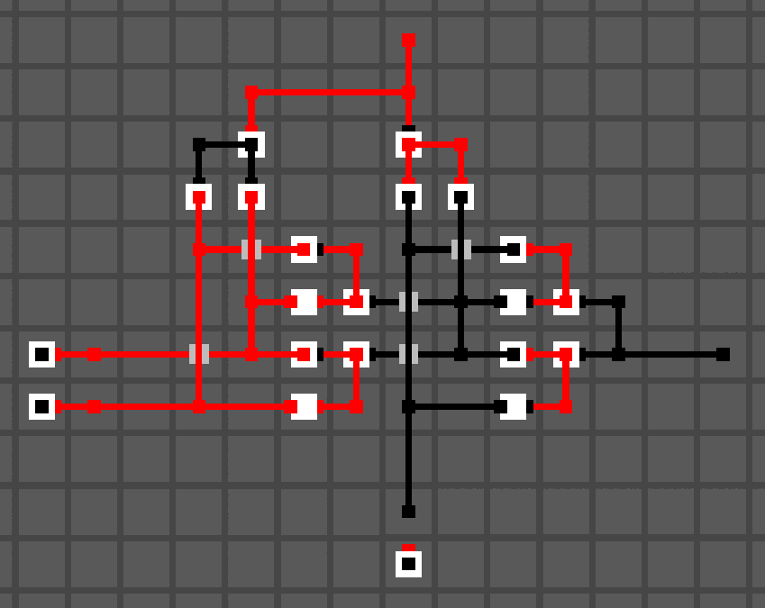

# FlipFlop

A digital logic simulator built on simple rules.

## How it works

In the world of FlipFlop, there are three fundamental logical components:
wires, flips, and flops.

**Wires** connect components together and have a binary "powered" state. The
state of a wire is determined by the states of the component outputs connected
to it: if any of the outputs are powered, then the wire is powered; inversely,
if all of the outputs are unpowered, then the wire is unpowered.

**Flips** are components with a single input and single output. The output is
the opposite of its input; if the input is powered, then the output is
unpowered, and vice versa. **Flops** are components similar to flips, except
the output is the same as its input.

When the input to a flip or flop changes, its output doesn't update
immediately. There is a small amount of delay, which is called the **tick
interval**. Ticks, more precisely, are points in time where all component
outputs get updated at the exact same time. When components update, they read
the state of their inputs from immediately before the tick, so components'
updates in the current tick can't affect each other.

Ticks happen repeatedly over time at a regular rate, called the **tick rate**.
By default, the tick rate is **100 ticks per second (TPS).** This rate is
inversely related to the tick interval; for example, for a tick rate of 100
TPS, the tick interval is 1/100 seconds per tick, which we usually write as
**10 milliseconds per tick (MSPT).**

## Acknowledgements

Inspired by:

- [TUNG](https://jimmycushnie.itch.io/tung) and [Logic
  World](https://logicworld.net) by Mouse Hat Games, for the art style and
logic mechanics.

- [Minecraft](https://www.minecraft.net) by Mojang Studios, for the grid-based
  building mechanics.

- [NandGame](https://www.nandgame.com) by Olav Junker Kjær, for the idea of
  building up from something simple.

## License

FlipFlop is distributed under the terms of both the MIT license and the Apache
license version 2.0. See [LICENSE-APACHE](LICENSE-APACHE),
[LICENSE-MIT](LICENSE-MIT), and [COPYRIGHT](COPYRIGHT) for details.

